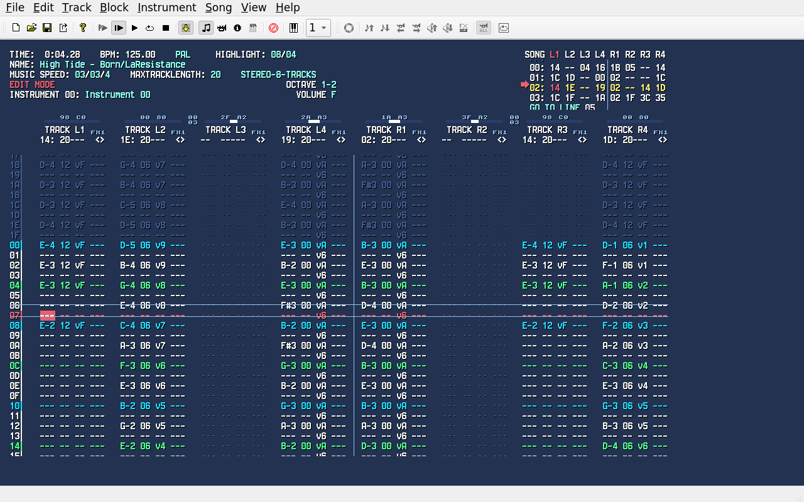
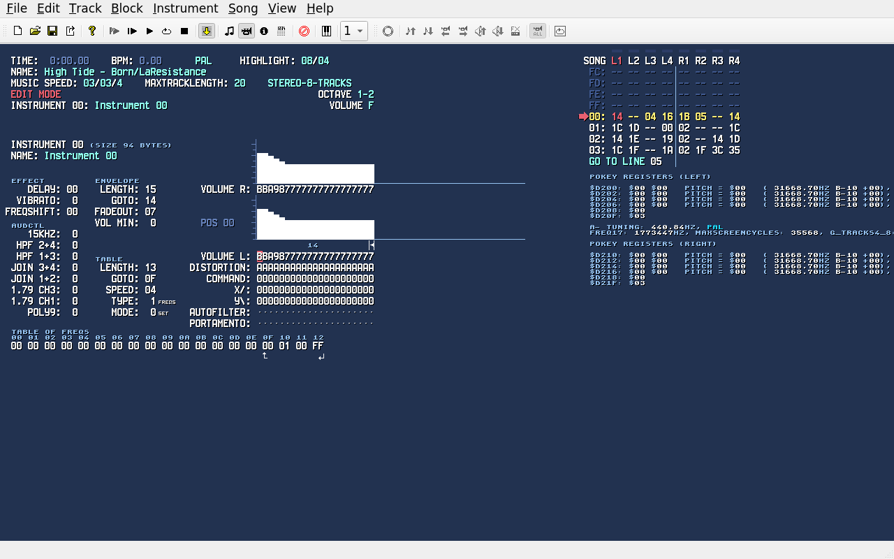
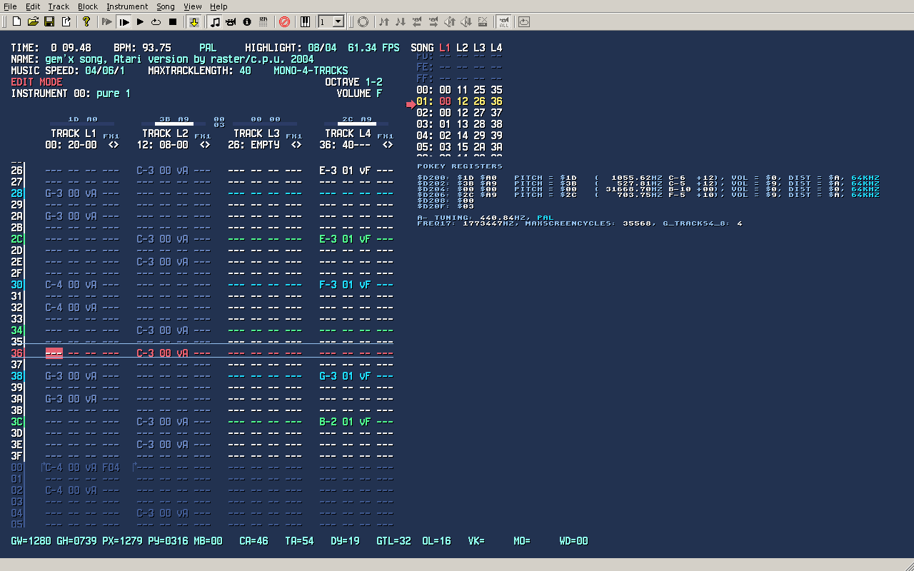
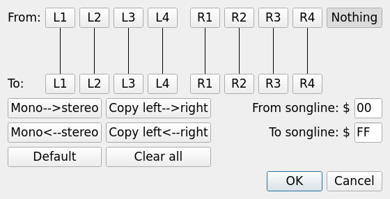
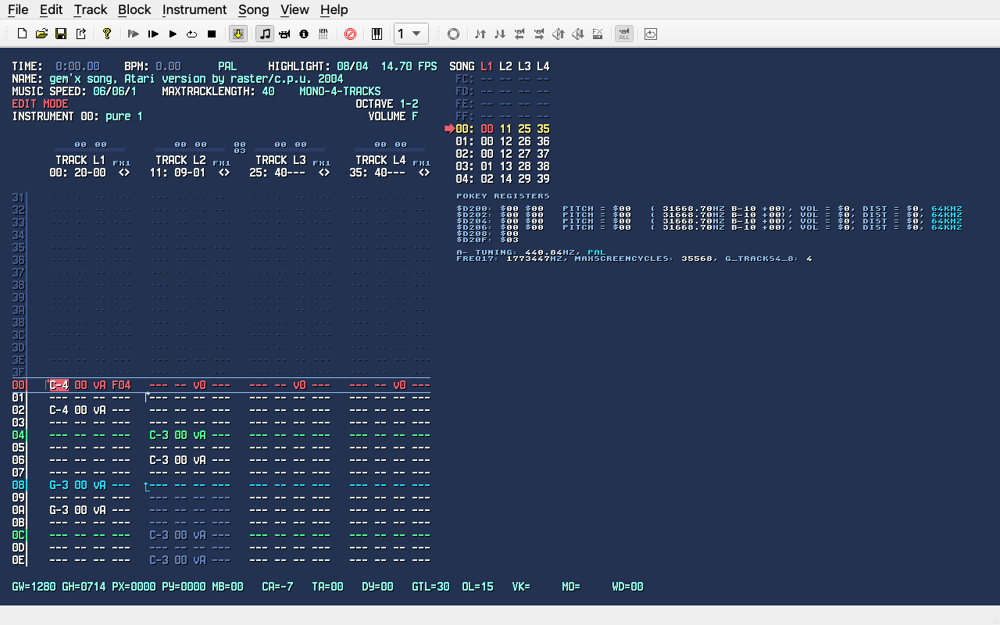

# RASTER Music Tracker 2.1 - the Qt port

### About

RASTER Music Tracker (short RMT) is a tool for making Atari XL/XE music
for the POKEY sound chip. RMT uses the Atari XL/XE music routines created by
Radek Štěrba from 2002 to 2009. It was a small revolution for all Atari
musicians and fans.

**RMT 2.x is a port of RMT to Qt6, so that it runs natively on Linux,
Windows and macOS** (Intel and Apple Silicon), and not only on Windows.
(RMT 2.0 was built with Qt5, 2.1 moved to Qt6.)

The heart of the program is **the original RMT code**: the tracker, the
editor, the Atari 6502 music routines, the POKEY emulation, the file formats,
the import and export are those of **RMT 1.35**, the development version by
Peter Dell (JAC!), itself the continuation of the original RMT 1.28 by Radek
Štěrba (Raster/C.P.U.) and of RMT 1.34 by Vin Samuel (VinsCool). The port
replaces only what tied RMT to Windows:

- the MFC windows, menus, toolbars and dialogs are now Qt6 (the tracker
  screen itself is drawn by the original code, pixel for pixel)
- the sound goes out through PortAudio, MIDI IN comes in through RtMidi
  (ALSA on Linux, WinMM on Windows, CoreMIDI on macOS)
- the 6502 and POKEY emulation is built in, no `sa_c6502.dll` /
  `apokeysnd.dll`
- the configuration is kept per user (QSettings), so it survives updates

Songs, instruments and tracks are the same files as in RMT 1.3x: you can
move your work between the Windows version and this one.


### Screenshots

*High Tide* by Born/LaResistance, a stereo song (8 tracks), playing on Linux:



The instrument editor:



The Windows version, from the v2.0 zip, playing *gem'x* by Raster (here run
under Wine on Linux):



A dialog of RMT rewritten in Qt (song columns' order) and the Apple Silicon
version on macOS, built by GitHub Actions:

<p>
  
  
</p>


### Please try it and tell me what you think!

This is the first release of the port. It has been used and tested mostly on
Linux; the Windows and macOS packages are built automatically and pass a
start-up test, but they have seen very little real use yet. **Any feedback is
very welcome**: does it start, does it sound right, do your songs load and
play as in RMT 1.3x, does MIDI work with your keyboard, is anything missing or
different from the Windows version you know?

- Open an [issue on GitHub](https://github.com/gianlucarenzi/RASTER-Music-Tracker/issues)
  (bugs, differences from RMT 1.3x, ideas)
- Please tell which package and system you used (e.g. "AppImage on Debian
  12", "DMG x86_64 on macOS 13"), and attach the song if it is about a song


### Download

[**RMT 2.1**](https://github.com/gianlucarenzi/RASTER-Music-Tracker/releases/tag/v2.1)
([all releases](https://github.com/gianlucarenzi/RASTER-Music-Tracker/releases)):

| System | Package | How to start it |
|--------|---------|-----------------|
| Linux x86_64 (Debian 11, Ubuntu 20.04 and newer) | [`RMT-Linux-x86_64.AppImage`](https://github.com/gianlucarenzi/RASTER-Music-Tracker/releases/download/v2.1/RMT-Linux-x86_64.AppImage) | `chmod +x RMT-Linux-x86_64.AppImage` and run it (needs `libfuse2`; without it: `--appimage-extract-and-run`) |
| Windows 64 bit | [`RMT-Windows-x64.zip`](https://github.com/gianlucarenzi/RASTER-Music-Tracker/releases/download/v2.1/RMT-Windows-x64.zip) | unzip it anywhere and run `Rmt.exe` (not signed: Windows may ask to confirm) |
| macOS 12 or later, Apple Silicon | [`RMT-macOS-arm64.dmg`](https://github.com/gianlucarenzi/RASTER-Music-Tracker/releases/download/v2.1/RMT-macOS-arm64.dmg) | drag `RMT.app` to Applications; the first time open it with right click → Open (not notarized) |
| macOS 12 or later, Intel | [`RMT-macOS-x86_64.dmg`](https://github.com/gianlucarenzi/RASTER-Music-Tracker/releases/download/v2.1/RMT-macOS-x86_64.dmg) | as above (also runs on Apple Silicon through Rosetta 2) |

Everything the program needs is inside each package. The configuration is
kept in `~/.config/raster-atari.org/rmt.conf` on Linux, in the registry
(`HKEY_CURRENT_USER\Software\raster-atari.org\rmt`) on Windows and in
`~/Library/Preferences/org.raster-atari.rmt.plist` on macOS.

The original Windows (MFC) versions of RMT are still available from the
upstream project:
- [Latest daily build of 1.35](https://www.wudsn.com/productions/windows/rastermusictracker/rmt135-daily.zip)
- [Stable version 1.34 (2023-03-10)](https://www.wudsn.com/productions/windows/rastermusictracker/rmt134.00-stable.zip)
- [Stable version 1.28 (2009-05-19)](https://www.wudsn.com/productions/windows/rastermusictracker/rmt128.zip)


### What is different in the port

- Everything of the Windows version is there: all the menus, the dialogs
  (configuration, tuning, export and import options, block effects, song and
  instrument tools...), the two toolbars, MIDI IN with MIDI on/off, the
  play modes and the keyboard shortcuts.
- MIDI IN devices are the ones of the system (on Linux the ALSA sequencer
  ports, e.g. a USB keyboard or a virtual port).
- Settings of an earlier installation of the port (`rmt.ini` / `tuning.ini`
  next to the program) are taken over at the first start.

Known limits: the packages are not signed; the macOS and Windows versions
need testing on real machines, sound and MIDI in particular.


### Building from source

On Linux:

```bash
sudo apt install cmake qt6-base-dev portaudio19-dev librtmidi-dev
cmake -B build-qt -DCMAKE_BUILD_TYPE=Release
cmake --build build-qt -j
./build-qt/out/rmt song.rmt
```

[BUILD.md](BUILD.md) has all the details: the other platforms, the
AppImage (`scripts/build-appimage.sh`), the GitHub workflows that build the
packages, the test hooks, and the state of every part of the Qt frontend.
The original Windows MFC version still builds with MSVC.


### Documentation

- Current [RMT 1.35 Documentation](https://html-preview.github.io/?url=https://github.com/peterdell/RASTER-Music-Tracker/blob/dev/doc/rmt_en.html) (it applies to the port too)
- Original [RMT 1.28 documentation](https://html-preview.github.io/?url=https://github.com/peterdell/RASTER-Music-Tracker/blob/dev/doc/rmt_en_128.html)
- The [change history](https://github.com/peterdell/RASTER-Music-Tracker/blob/dev/doc/rmt_changes.md) and the [versions](https://github.com/peterdell/RASTER-Music-Tracker/blob/dev/doc/rmt_versions.md) of RMT

Technical Documentation
- Current [RMT Tracker documentation](https://github.com/peterdell/RASTER-Music-Tracker/blob/dev/doc/rmt_tracker.md) and discussion
- Current [RMT Module File Format documentation](https://github.com/peterdell/RASTER-Music-Tracker/blob/dev/doc/rmt_format.md) and discussion


### Main features

Note that this is as of RMT 1.28 and not accurate for 1.34 and later!

* Mono 4 tracks / stereo 8 tracks.
* 254 tracks, each with its own length (256 beats max.) and with support for track loop.
* 64 instruments (stereo, instrument table up to 32 steps - 2 types and 2 modes with loop,
  instrument envelope up to 32 steps with loop, portamento, filter, 16bit bass, volume slide,
  volume minimum, vibrato, frequency shifting, etc.).Fully automatic management of AUDCTL
  register (filters, 16bit basses) and/or manual AUDCTL settings.
* Support for "volume only" forced output.
* Note portamento up/down effect.
* Instrument envelope commands for note/frequency shifting and support for special 
  "like a C64 SID chip" filtering.
* Up to 256 lines for song (with "goto line" support).
* Beat speed 1 to 255 (1/50 to 255/50 sec).
* Instrument speed from 1 to 4 per screen (up to 1/200 sec).
* Main input/output song file format: RMT song files (*.rmt).
* Input/output instrument file format: RMT instrument files (*.rti).
* Export formats: RMT stripped song file (*.rmt), SAP file (*.sap),
  XEX Atari executable MSX file (*.xex), ASM simple notation source (*.asm).
* Import formats: ProTracker modules (*.mod), Atari XE/XL Theta Music Composer songs (*.tmc)
* Support for speed/size optimizations of RMT assembler player routine 
  for a concrete RMT module (very useful for background music in demos, games, etc.).
* MIDI IN support!
* MIDI multitimbral playing possibilities.
  You can use the RMT like an Atari multitimbral MIDI instrument. 
  You have to send MIDI output from your MIDI sequencer or player 
  to RMT MIDI input by means of some virtual MIDI cable (on Linux an ALSA
  sequencer port, on Windows for example "loopMIDI", on macOS the IAC
  driver). The MIDI implementation chart is in the [midi.txt](doc/midi.txt) file.


### Known Issues

Issues of the Qt port are tracked on the [GitHub issue tracker of the port](https://github.com/gianlucarenzi/RASTER-Music-Tracker/issues).
Issues of the original RMT are tracked on the [upstream issue tracker](https://github.com/raster-atari-org/RASTER-Music-Tracker/issues).


### Credits

- [Radek Štěrba](http://atariki.krap.pl/index.php/Raster/C.P.U.), Raster/C.P.U., 2002-2009 ([original website](http://raster.infos.cz/atari/rmt/rmt.htm))<br>
  Thank you for everything you did, we truly miss you <3.
- Robert Petruzela, Bob!k/C.P.U. and - JirkaS/C.P.U.
- [Vin Samuel](https://github.com/VinsCool), VinsCool, 2021-2024
- [Peter Dell](https://www.wudsn.com), JAC!, 2024 to present
- [Gianluca Renzi](https://github.com/gianlucarenzi), 2026: the Qt port (Linux, Windows, macOS)

#### Additional Credits
- New features, bugfixes and improvements for RMT 1.31-1.34 by VinsCool
- POKEY Tuning Calculations programming by VinsCool, with helpful advices from synthpopalooza and OPNA2608
- SAP-R Dumper and VUPlayer programming by VinsCool
- LZSS compression programming by DMSC, C++ port by VinsCool
- Unrolled LZSS music driver by Rensoupp, with few changes and new features by VinsCool
- New Bitmap graphics, ideas and beta testing by PG
- Ideas, features suggestions and inspiration by PG, Enderdude, Spring, Ivop, Tatqoo, Miker
- Spiteful inspiration by Rensoupp, Emkay, and anyone who challenged me to try doing things believed impossible or outside of my abilities ;)
- Special thanks to everyone from The Chiptune Café, AtariAge, and GBAtemp who motivated me to work harder on the revival of RMT!

### Greetings

- Fox/Taquart - Thanks for [XASM](https://github.com/pfusik/xasm) and [ASAP](https://asap.sourceforge.net)
- Jaskier/Taquart - Thanks for TMC and a lot of RMT routine speed/size optimizations
- Tatqoo/Taquart
- Sack/Cosine
- X-ray/Grayscale
- Greg/Grayscale
- Bewu/Grayscale
- PG - Thanks for the [ASMA - Atari SAP Music Archive](https://asma.atari.org)
- Fandal
- ZdenekB
- KrupkaJ
- Pepax
- LiSU
- Miker
- Dely
- Nils Feske
- Elan
- Wrathchild
- Kozyca
- Born/LaResistance
- Sal Esquivel
- Nooly
- All the active "Atariarea" Polish Atarians (https://atariarea.krap.pl)<br>
- ...and all other 8-bit Atarians all over the world! :-)


### Disclaimer

THIS SOFTWARE IS PROVIDED "AS IS" WITHOUT WARRANTY OF ANY KIND.
AUTHOR DOES NOT WARRANT, GUARANTEE, OR MAKE ANY REPRESENTATIONS REGARDING THE USE, OR THE RESULTS OF USE, OF THE SOFTWARE OR WRITTEN MATERIALS IN TERMS OF CORRECTNESS, ACCURACY, RELIABILITY, CURRENTNESS, OR OTHERWISE.
THE ENTIRE RISK AS TO THE RESULTS AND PERFORMANCE OF THE SOFTWARE IS ASSUMED BY YOU.
